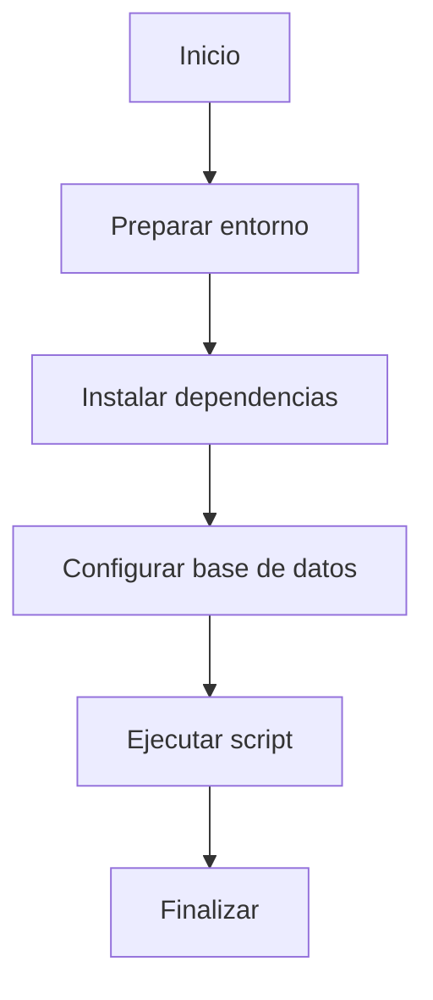

# Video Analytics ADB CF

Implementación de Analytics de video para aprender sobre bases de datos

```mermaid
flowchart
    A[Inicio] --> B[Preparar entorno]
    B --> C[Instalar dependencias]
    C --> D[Configurar base de datos]
    D --> E[Ejecutar script]
    E --> F[Finalizar]
```

